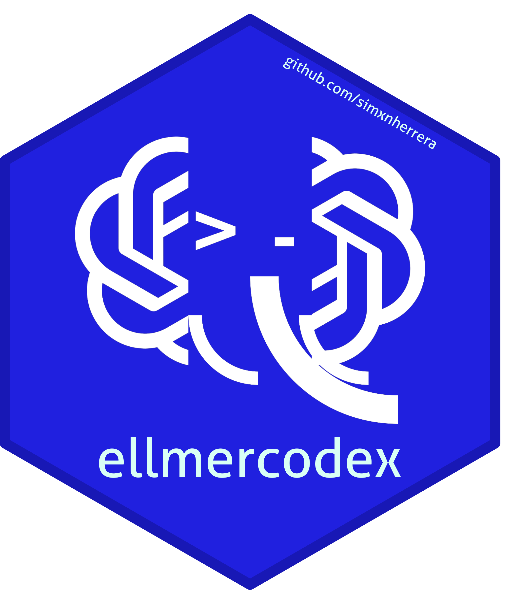

# ellmercodex 

<!-- badges: start -->

[](https://github.com/simxnherrera/ellmercodex/actions/workflows/R-CMD-check.yaml)
[](https://github.com/simxnherrera/ellmercodex/tags)
[](https://github.com/simxnherrera/ellmercodex/blob/main/LICENSE.md)

<!-- badges: end -->

`ellmercodex` lets you use a Codex subscription from R through an
[`ellmer`](https://ellmer.tidyverse.org/) chat interface. The normal workflow
is to sign in, create a chat, and then use the regular `ellmer` Chat methods.

The package is independent of OpenAI and does not require an API key or the
Codex CLI. Subscription authentication and transport are compatibility surfaces
that may change; see the [technical documentation](docs/technical-design.md)
for the implementation, support boundaries, and current risks.

## Install

Install the current tagged release from GitHub with
[`pak`](https://pak.r-lib.org/):

```r
install.packages("pak")
pak::pak("simxnherrera/ellmercodex@v0.1.62")
```

To install the development version:

```r
pak::pak("simxnherrera/ellmercodex")
```

## Quick start

Check the local integration, sign in, and create a chat:

```r
library(ellmercodex)

codex_available()
codex_login()

chat <- chat_codex(
  system_prompt = "Be concise and helpful.",
  model = "gpt-5.6-luna"
)

chat$chat("Explain why reproducible examples matter in R packages.")
chat$chat("Now summarize that in one sentence.")
```

The returned object is an `ellmer` `Chat`, so each `$chat()` call keeps the
conversation history. Use `$stream()` when you want streamed output:

```r
chat$stream("Give me three ideas for naming an R package.")
```

If you have already signed in and the credential is available, you can call
`chat_codex()` directly. With `model = NULL`, the package selects a usable
model from the authenticated account catalog.

## Choose a model

Model availability depends on your account and workspace. Query the catalog
after signing in:

```r
models <- codex_models()
models[c("id", "display_name", "default_reasoning_effort",
         "supported_reasoning_efforts")]
```

Select a model explicitly when needed:

```r
chat <- chat_codex(model = "gpt-5.6-luna")
```

Reasoning effort can be supplied directly or through ellmer-style parameters:

```r
chat <- chat_codex(model = "gpt-5.6-luna", effort = "max")

chat <- chat_codex(
  model = "gpt-5.6-luna",
  params = ellmer::params(reasoning_effort = "max")
)
```

Use `ELLMERCODEX_MODEL` when you want an explicit model without passing
`model` each time:

```r
Sys.setenv(ELLMERCODEX_MODEL = "gpt-5.6-luna")
chat <- chat_codex()
```

## Tool calling

Register tools with the normal `ellmer` API:

```r
weather_tool <- ellmer::tool(
  function(city) paste("Sunny in", city),
  name = "get_weather",
  description = "Get the current weather for a city.",
  arguments = list(city = ellmer::type_string())
)

chat <- chat_codex(model = "gpt-5.6-luna")
chat$register_tool(weather_tool)
chat$chat("What is the weather in Montevideo?")
```

Tool requests and results remain in the conversation history as the usual
`ellmer` content objects.

## Structured output

Use ellmer's type system with `$chat_structured()`:

```r
chat <- chat_codex(model = "gpt-5.6-luna")
chat$chat_structured(
  "My name is Susan and I'm 13 years old.",
  type = ellmer::type_object(
    name = ellmer::type_string(),
    age = ellmer::type_integer()
  )
)
```

As in ellmer, structured requests do not use registered tools. Gather any
tool-assisted context with `$chat()` first, then extract the result with
`$chat_structured()`.

## Async chat and cancellation

The returned chat also supports ellmer's asynchronous methods:

```r
chat$chat_async("Summarize the conversation.")

controller <- ellmer::stream_controller()
stream <- chat$stream_async(
  "Write a short story.",
  stream = "content",
  controller = controller
)
# Pass `stream` to an async consumer such as a Shiny chat component.
# Call `controller$cancel()` from the UI to stop generation.
```

Images and PDFs can be passed with ellmer's normal content constructors:

```r
chat$chat(
  ellmer::content_image_url("https://example.com/diagram.png"),
  ellmer::ContentPDF("application/pdf", "<base64-data>", "report.pdf"),
  "Explain these files."
)
```

## Authentication

Inspect sign-in state with a redacted account summary:

```r
codex_account()
```

For a process-only session, use:

```r
codex_login(persist = FALSE)
```

Sign out and remove the credential owned by this package with:

```r
codex_logout()
```

## Documentation and support

The README is intentionally focused on installation and user-facing workflows.
For more detail:

- The [getting-started vignette](vignettes/getting-started.Rmd) walks through
  authentication, chats, tools, structured output, and conditions.
- The [technical design](docs/technical-design.md) documents the architecture,
  credential lifecycle, transport boundary, error taxonomy, and release risks.
- The [ellmer compatibility inventory](docs/ellmer-chat-interface.md) records
  the supported Chat methods, signatures, return shapes, and state transitions.
- In an R session, use `?chat_codex`, `?codex_login`, `?codex_models`, and
  `?ellmercodex-conditions` for the function reference.

The stable scope is interactive, single-conversation use of the public
`ellmer` 0.4.2 `Chat` object. The separate `parallel_chat*()` and
`batch_chat*()` helpers are not supported by this package.
