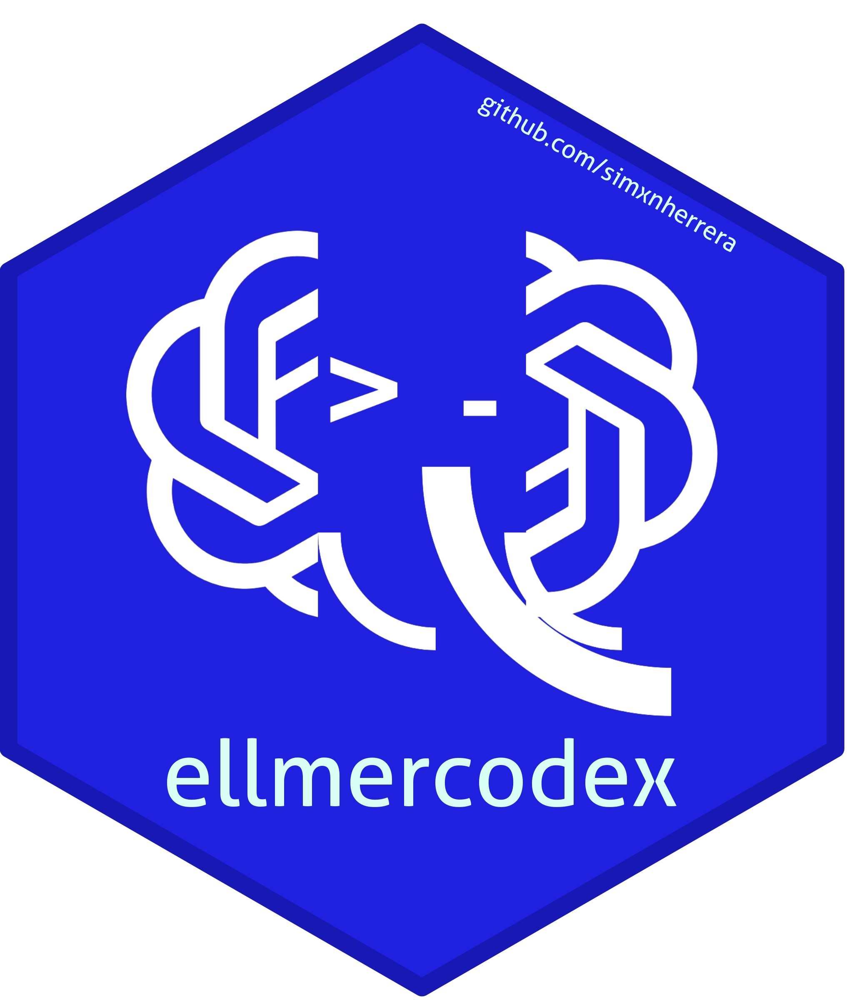

# ellmercodex 

<!-- badges: start -->

[](https://github.com/simxnherrera/ellmercodex/actions/workflows/R-CMD-check.yaml)
[](https://github.com/simxnherrera/ellmercodex/tags)
[](https://github.com/simxnherrera/ellmercodex/blob/main/LICENSE.md)

<!-- badges: end -->

`ellmercodex` te permite usar una cuenta de ChatGPT desde R a través de una
interfaz de chat de [`ellmer`](https://ellmer.tidyverse.org/): los modelos
incluidos en tu plan de ChatGPT funcionan como un proveedor más de `ellmer`,
sin clave de API. Así puedes incorporar modelos de lenguaje a tus flujos de
análisis en R.

El paquete es independiente de OpenAI y no requiere una clave de API ni el
CLI de Codex. Usa el flujo documentado por OpenAI
["Sign in with ChatGPT"](https://developers.openai.com/siwc/token-sharing-open-source)
para apps de código abierto que se ejecutan localmente, y la API pública de
Responses. Consulta la
[documentación técnica](https://github.com/simxnherrera/ellmercodex/blob/main/docs/technical-design.md) para conocer los límites de
soporte, la implementación y los riesgos actuales.

Los ejemplos de resultados estructurados y herramientas están inspirados en
el [artículo sobre `ellmercodex` en el blog](https://simxnherrera.github.io/blog/ellmercodex/).

### Instalación

El paquete todavía no está en CRAN. Instálalo desde GitHub usando
[`pak`](https://pak.r-lib.org/):

```r
install.packages("pak")
pak::pak("simxnherrera/ellmercodex")
```

Si vienes de una versión 0.1.x, vuelve a iniciar sesión con `codex_login()`
después de actualizar: la forma de autenticación cambió y las credenciales
anteriores no se conservan.

### Inicio rápido

Comprueba la integración local, inicia sesión y crea una conversación:

```r
library(ellmercodex)

codex_available()
auth <- codex_login()

chat <- chat_codex(model = "gpt-6-luna", effort = "low")
chat$chat("Hola desde R")
#> ¡Hola! ¿En qué puedo ayudarte con R?
```

`codex_login()` abre una ventana del navegador para autenticarte con tu
cuenta de ChatGPT. Como `chat_codex()` devuelve un objeto `Chat` de `ellmer`,
puedes usar buena parte de su interfaz habitual. Cada llamada a `$chat()`
mantiene el historial de la conversación; usa `$stream()` si quieres recibir
la respuesta en streaming:

```r
chat$stream("Dame tres ideas para nombrar un paquete de R.")
```

Si ya iniciaste sesión y la credencial está disponible, puedes llamar a
`chat_codex()` directamente. Con `model = NULL`, el paquete selecciona un
modelo utilizable del catálogo de tu cuenta autenticada.

### No es solo un chatbot

Como trabajamos con un objeto `Chat` de `ellmer`, podemos pedir resultados
estructurados en lugar de texto libre. Por ejemplo, podemos clasificar un
fragmento de un debate parlamentario sobre la regulación del cannabis:

```r
# Fragmento real de un debate parlamentario sobre regulación del cannabis
fragmento <- paste(
  "seguimos pensando que además de la represión y del combate al",
  "narcotráfico que debe seguir con firmeza y decisión como sociedad",
  "debemos apostar a dos o tres pilares fundamentales la educación",
  "la prevención y la rehabilitación"
)

resultado <- chat$chat_structured(
  paste(
    "Clasifica el fragmento como PREVENTIVA, PUNITIVA, MIXTA o",
    "SIN_ORIENTACIÓN_ATRIBUIBLE.",
    "Usa MIXTA cuando se defiendan simultáneamente respuestas",
    "preventivas y punitivas.",
    "\n\nFragmento:",
    fragmento
  ),
  type = ellmer::type_object(
    codigo = ellmer::type_enum(c(
      "PREVENTIVA",
      "PUNITIVA",
      "MIXTA",
      "SIN_ORIENTACIÓN_ATRIBUIBLE"
    )),
    justificacion = ellmer::type_string()
  )
)

resultado
#> $codigo
#> [1] "MIXTA"
#>
#> $justificacion
#> [1] "El fragmento defiende explícitamente la represión y el combate al
#> narcotráfico, que son respuestas punitivas, y simultáneamente propone la
#> educación, la prevención y la rehabilitación, de carácter preventivo o
#> rehabilitador."
```

Para tareas de análisis de texto, esto permite solicitar directamente una
estructura que R pueda incorporar a un `data.frame`, validar o analizar.

### Un agente dentro de R

También puedes registrar funciones como herramientas que el modelo puede decidir
utilizar durante una conversación. Supongamos que tenemos intervenciones
parlamentarias ya clasificadas:

```r
intervenciones <- data.frame(
  partido = c("FA", "FA", "PN", "PN", "PN"),
  orientacion = c(
    "PREVENTIVA",
    "MIXTA",
    "PUNITIVA",
    "PUNITIVA",
    "MIXTA"
  )
)
```

Podemos crear una función de R que resuma las orientaciones observadas para
un partido y exponerla al modelo como una herramienta de `ellmer`:

```r
resumir_partido <- function(partido_buscado) {
  intervenciones |>
    dplyr::filter(partido == partido_buscado) |>
    dplyr::count(orientacion)
}

resumen_tool <- ellmer::tool(
  resumir_partido,
  name = "resumir_partido",
  description = "Cuenta las orientaciones discursivas de un partido.",
  arguments = list(
    partido_buscado = ellmer::type_string()
  )
)

chat$register_tool(resumen_tool)

chat$chat(
  paste(
    "Compara las orientaciones discursivas de FA y PN.",
    "Usa la herramienta disponible."
  )
)
#> - **FA:** 1 fragmento **MIXTO** y 1 **PREVENTIVO**.
#> - **PN:** 1 fragmento **MIXTO** y 2 **PUNITIVOS**.
#>
#> En comparación, ambos presentan orientación mixta, pero el **FA** también
#> muestra una orientación preventiva, mientras que el **PN** registra una
#> mayor presencia de respuestas punitivas.
```

El modelo puede decidir llamar a `resumir_partido()` para cada partido, recibir
los resultados producidos por R y utilizarlos para elaborar su respuesta. La
herramienta podría consultar una base de datos, buscar en un corpus, realizar
un cálculo, recuperar información de una API o ejecutar cualquier otra
operación que decidas implementar.

R sigue siendo quien ejecuta las funciones: el modelo solo puede utilizar las
herramientas que registres explícitamente y decide cuándo usarlas y con qué
argumentos.

### Elegir un modelo

La disponibilidad de modelos depende de tu cuenta y espacio de trabajo.
Consulta el catálogo después de iniciar sesión:

```r
modelos <- codex_models()
modelos[c("id", "display_name", "default_reasoning_effort",
          "supported_reasoning_efforts")]
```

El catálogo no siempre incluye todos los modelos que acepta el servicio.
Puedes pasar explícitamente un ID aunque no aparezca en `codex_models()`, y
el servicio validará el modelo y el esfuerzo. Por ejemplo, `gpt-6-luna`
funciona aunque el catálogo no lo liste.

Puedes seleccionar un modelo y el esfuerzo de razonamiento explícitamente:

```r
chat <- chat_codex(model = "gpt-6-luna", effort = "max")

chat <- chat_codex(
  model = "gpt-6-luna",
  params = ellmer::params(reasoning_effort = "max")
)
```

Usa `ELLMERCODEX_MODEL` si quieres establecer un modelo sin pasarlo cada vez:

```r
Sys.setenv(ELLMERCODEX_MODEL = "gpt-6-luna")
chat <- chat_codex()
```

### Chat asíncrono y cancelación

El objeto `Chat` también admite los métodos asíncronos de `ellmer`:

```r
chat$chat_async("Resume la conversación.")

controller <- ellmer::stream_controller()
stream <- chat$stream_async(
  "Escribe un cuento breve.",
  stream = "content",
  controller = controller
)
# Pasa `stream` a un consumidor asíncrono, como un componente de chat de Shiny.
# Llama a `controller$cancel()` desde la interfaz para detener la generación.
```

También puedes enviar imágenes y PDF usando los constructores habituales de
`ellmer`:

```r
chat$chat(
  ellmer::content_image_url("https://example.com/diagram.png"),
  ellmer::ContentPDF("application/pdf", "<base64-data>", "report.pdf"),
  "Explica estos archivos."
)
```

### Autenticación

`codex_login()` abre el navegador para que elijas tu cuenta y espacio de
trabajo de ChatGPT y autorices el uso de tu plan. La primera vez se crea un
registro vinculado a esa cuenta; los inicios de sesión siguientes lo
reutilizan. La credencial se guarda en `tools::R_user_dir("ellmercodex",
"config")` (o en `ELLMERCODEX_HOME`) con permisos solo para tu usuario.

Consulta el estado de inicio de sesión con un resumen de cuenta redactado:

```r
codex_account()
```

Para una sesión que solo dure lo que dure el proceso, usa:

```r
  auth <- codex_login(persist = FALSE)
```

Cierra la sesión, revoca el token y elimina la credencial administrada por
este paquete con `codex_logout()`. Para cambiar de cuenta o de espacio de
trabajo, cierra sesión y vuelve a llamar a `codex_login()`:

```r
codex_logout()
```

### Una pequeña advertencia

El uso del plan de ChatGPT mediante "Sign in with ChatGPT" es una función en
vista previa de OpenAI: requiere un plan y un espacio de trabajo elegibles, y
sus límites y funciones admitidas pueden cambiar. Mientras dure la vista
previa no se admiten `temperature`, `top_p`, `max_tokens` ni otros argumentos
que OpenAI excluye; el paquete los rechaza antes de enviar la solicitud.

`ellmercodex` es una integración independiente y no está afiliada a OpenAI ni
cuenta con su respaldo. El foco actual está puesto en el objeto `Chat` de
`ellmer` 0.5.0 o posterior y en operaciones interactivas sobre una conversación.
El conteo de tokens del proveedor, la gestión de archivos y las funciones
`parallel_chat()` y `batch_chat()` no están soportados.

### Documentación y soporte

Para más detalles:

- La [viñeta de introducción](https://github.com/simxnherrera/ellmercodex/blob/main/vignettes/getting-started.Rmd) recorre la
  autenticación, los chats, las herramientas, los resultados estructurados y
  las condiciones.
- El [diseño técnico](https://github.com/simxnherrera/ellmercodex/blob/main/docs/technical-design.md) documenta la arquitectura, el
  ciclo de vida de las credenciales, el límite de transporte, la taxonomía de
  errores y los riesgos de publicación.
- El [inventario de compatibilidad con `ellmer`](https://github.com/simxnherrera/ellmercodex/blob/main/docs/ellmer-chat-interface.md)
  registra los métodos `Chat` soportados, sus firmas, los valores devueltos y
  las transiciones de estado.
- Para conservar credenciales en una aplicación alojada, consulta la
  [guía de despliegue en una VM Linux de un solo proceso](https://github.com/simxnherrera/ellmercodex/blob/main/docs/hosted-oauth.md).
- En una sesión de R, usa `?chat_codex`, `?codex_login`, `?codex_models` y
  `?ellmercodex-conditions` para consultar la referencia de funciones.

El alcance estable es el uso interactivo de una sola conversación mediante el
objeto `Chat` público de `ellmer` 0.5.0 o posterior. El conteo de tokens del
proveedor, la gestión de archivos y las funciones independientes
`parallel_chat*()` y `batch_chat*()` no están soportadas por este paquete.

## English version

`ellmercodex` lets you use your ChatGPT plan from R through an
[`ellmer`](https://ellmer.tidyverse.org/) chat interface: the models in your
plan work as one more `ellmer` provider, with no API key. The normal workflow
is to sign in, create a chat, and then use the regular `ellmer` Chat methods.

The package is independent of OpenAI and does not require an API key or the
Codex CLI. It uses OpenAI's documented
["Sign in with ChatGPT"](https://developers.openai.com/siwc/token-sharing-open-source)
flow for open-source, locally hosted apps and the public Responses API. See the
[technical documentation](https://github.com/simxnherrera/ellmercodex/blob/main/docs/technical-design.md)
for the implementation, support boundaries, and current risks. ChatGPT plan
usage is an OpenAI preview: it needs an eligible plan and workspace, and it
does not accept `temperature`, `top_p`, `max_tokens`, or other excluded
arguments.

### Install

The package is not on CRAN yet. Install it from GitHub with
[`pak`](https://pak.r-lib.org/):

```r
install.packages("pak")
pak::pak("simxnherrera/ellmercodex")
```

If you are upgrading from 0.1.x, sign in again with `codex_login()`: the
authentication flow changed and earlier credentials are not kept.

### Quick start

Check the local integration, sign in, and create a chat:

```r
library(ellmercodex)

codex_available()
auth <- codex_login()

chat <- chat_codex(
  system_prompt = "Be concise and helpful.",
  model = "gpt-6-luna"
)

chat$chat("Explain why reproducible examples matter in R packages.")
chat$chat("Now summarize that in one sentence.")
```

The returned object is an `ellmer` `Chat`, so each `$chat()` call keeps the
conversation history. Use `$stream()` when you want streamed output:

```r
chat$stream("Give me three ideas for naming an R package.")
```

If you have already signed in and the credential is available, you can call
`chat_codex()` directly. With `model = NULL`, the package selects a usable
model from the authenticated account catalog.

### Choose a model

Model availability depends on your account and workspace. Query the catalog
after signing in:

```r
models <- codex_models()
models[c("id", "display_name", "default_reasoning_effort",
         "supported_reasoning_efforts")]
```

The catalog does not always include every model the service accepts. You can
pass a model ID explicitly even when it is absent from `codex_models()`, and
the service validates the model and reasoning effort. For example,
`gpt-6-luna` works although the catalog does not list it.

Select a model explicitly when needed:

```r
chat <- chat_codex(model = "gpt-6-luna")
```

Reasoning effort can be supplied directly or through ellmer-style parameters:

```r
chat <- chat_codex(model = "gpt-6-luna", effort = "max")

chat <- chat_codex(
  model = "gpt-6-luna",
  params = ellmer::params(reasoning_effort = "max")
)
```

Use `ELLMERCODEX_MODEL` when you want an explicit model without passing
`model` each time:

```r
Sys.setenv(ELLMERCODEX_MODEL = "gpt-6-luna")
chat <- chat_codex()
```

### Tool calling

Register tools with the normal `ellmer` API:

```r
weather_tool <- ellmer::tool(
  function(city) paste("Sunny in", city),
  name = "get_weather",
  description = "Get the current weather for a city.",
  arguments = list(city = ellmer::type_string())
)

chat <- chat_codex(model = "gpt-6-luna")
chat$register_tool(weather_tool)
chat$chat("What is the weather in Montevideo?")
```

Tool requests and results remain in the conversation history as the usual
`ellmer` content objects.

### Structured output

Use ellmer's type system with `$chat_structured()`:

```r
chat <- chat_codex(model = "gpt-6-luna")
chat$chat_structured(
  "My name is Susan and I'm 13 years old.",
  type = ellmer::type_object(
    name = ellmer::type_string(),
    age = ellmer::type_integer()
  )
)
```

As in ellmer, structured requests do not use registered tools. Gather any
tool-assisted context with `$chat()` first, then extract the result with
`$chat_structured()`.

### Async chat and cancellation

The returned chat also supports ellmer's asynchronous methods:

```r
chat$chat_async("Summarize the conversation.")

controller <- ellmer::stream_controller()
stream <- chat$stream_async(
  "Write a short story.",
  stream = "content",
  controller = controller
)
# Pass `stream` to an async consumer such as a Shiny chat component.
# Call `controller$cancel()` from the UI to stop generation.
```

Images and PDFs can be passed with ellmer's normal content constructors:

```r
chat$chat(
  ellmer::content_image_url("https://example.com/diagram.png"),
  ellmer::ContentPDF("application/pdf", "<base64-data>", "report.pdf"),
  "Explain these files."
)
```

### Authentication

`codex_login()` opens the browser so you can choose your ChatGPT account and
workspace and allow ChatGPT plan usage. The first sign-in creates a
registration bound to that account; later sign-ins reuse it. The credential is
stored in `tools::R_user_dir("ellmercodex", "config")` (or `ELLMERCODEX_HOME`)
with owner-only permissions.

Inspect sign-in state with a redacted account summary:

```r
codex_account()
```

For a process-only session, use:

```r
auth <- codex_login(persist = FALSE)
```

Sign out, revoke the token, and remove the credential owned by this package
with `codex_logout()`. To switch accounts or workspaces, sign out and call
`codex_login()` again:

```r
codex_logout()
```

### Documentation and support

The README is intentionally focused on installation and user-facing workflows.
For more detail:

- The [getting-started vignette](https://github.com/simxnherrera/ellmercodex/blob/main/vignettes/getting-started.Rmd) walks through
  authentication, chats, tools, structured output, and conditions.
- The [technical design](https://github.com/simxnherrera/ellmercodex/blob/main/docs/technical-design.md) documents the architecture,
  credential lifecycle, transport boundary, error taxonomy, and release risks.
- The [ellmer compatibility inventory](https://github.com/simxnherrera/ellmercodex/blob/main/docs/ellmer-chat-interface.md) records
  the supported Chat methods, signatures, return shapes, and state transitions.
- For persistent credentials in a hosted app, see the
  [single-process Linux VM guide](https://github.com/simxnherrera/ellmercodex/blob/main/docs/hosted-oauth.md).
- In an R session, use `?chat_codex`, `?codex_login`, `?codex_models`, and
  `?ellmercodex-conditions` for the function reference.

The stable scope is interactive, single-conversation use of the public
`ellmer` `Chat` object (0.5.0 or later). Provider token counting and file
management, as well as the separate `parallel_chat*()` and `batch_chat*()`
helpers, are unsupported by this package.
